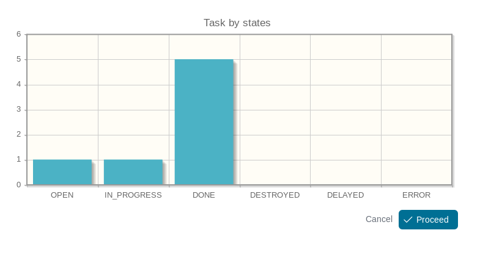

# Demo for the experimental workflow stats API

This demo is using the experimental workfow stats API.

```java
var stats = WorkflowStats.of(ISecurityContext.current());
var result = stats.task().byState();
```


