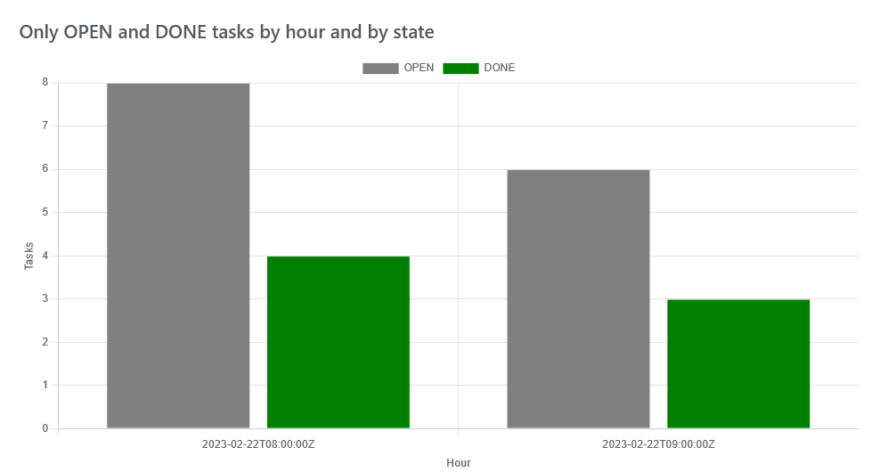

# Demo for the workflow statistic REST API

This demo is using the workflow statistic REST API.

```jscript
const response = await fetch(basePath + '/api/workflow/tasks/stats?agg=startTimestamp:bucket:hour,businessState&amp;filter=businessState:OPEN DONE');
const result = await response.json();
```


